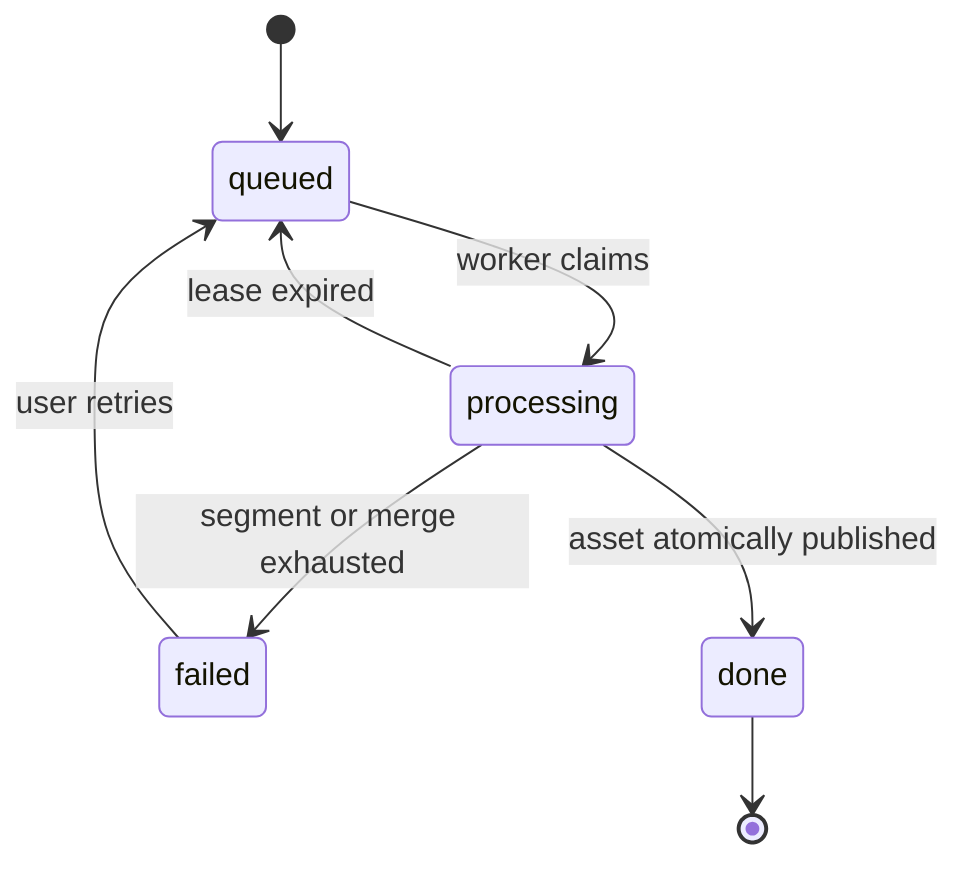

# API 与数据设计

本文记录已经实现的契约。整篇任务与资产 ID 是最长 32 字符的不透明字符串；客户端不得解析其格式。

## 1. 数据表

### 1.1 `article_tts_jobs`

持久化整篇准备任务和 Worker 租约。

| 字段 | 说明 |
| --- | --- |
| `id` | 主键 |
| `user_id` | 所有者，外键到用户 |
| `article_id` | 文章，外键到文章 |
| `input_hash` | 冻结输入哈希 |
| `status` | `queued / processing / done / failed / cancelled` |
| `total_segments` | 总段数 |
| `completed_segments` | 已准备段数 |
| `failed_segment_id` | 最终失败段，可空 |
| `failed_segment_order` | 失败段顺序，可空 |
| `attempt_count` | 整体领取次数 |
| `error_code` / `error_message` | 稳定错误码和诊断文本 |
| `lease_owner` | 当前 Worker 标识，可空 |
| `lease_expires_at` / `heartbeat_at` | 租约恢复字段 |
| `asset_id` | 成功后的整篇资产，可空 |
| `created_at` / `updated_at` / `started_at` / `finished_at` | 审计时间 |

约束：

- `0 <= completed_segments <= total_segments`。
- 相同 `user_id + article_id + input_hash` 只保留一个幂等任务；失败任务通过 retry 回到队列，不创建同版本副本。
- `done` 必须有关联的 ready 资产。
- 所有 job 查询都必须校验 `user_id`。

### 1.2 `article_tts_assets`

描述已经或正在生成的整篇版本化媒体。

| 字段 | 说明 |
| --- | --- |
| `id` | 主键/对外不透明标识 |
| `user_id` | 冗余所有者字段，便于强制鉴权和索引 |
| `article_id` | 文章外键 |
| `input_hash` | 唯一版本输入哈希 |
| `status` | `building / ready / deleting / failed` |
| `voice` / `speed` | 已解析的音色与速度 |
| `pause_policy_version` | 停顿策略版本 |
| `encoder_profile_version` | 编码配置版本 |
| `timeline_version` | 全局时间轴版本 |
| `audio_path` | 服务端相对路径，不直接返回客户端 |
| `duration_ms` / `file_size` | ffprobe/文件系统实测值 |
| `timeline_json` | JSON 全局句子时间轴 |
| `created_at` / `updated_at` / `ready_at` | 审计时间 |

约束：

- 同一 `user_id + article_id + input_hash` 至多一个资产记录。
- `ready` 资产必须有路径、正数时长和正数文件大小。
- API 返回 `asset_id` 和受保护媒体 URL，不返回 `audio_path`。

### 1.3 `article_tts_asset_segments`

记录整篇资产对分段缓存的精确依赖与全局位置。

| 字段 | 说明 |
| --- | --- |
| `article_asset_id` | 整篇资产外键 |
| `segment_id` | 文章段落外键 |
| `segment_tts_asset_id` | 被复用的分段 TTS 资产外键 |
| `segment_order` | 快照顺序 |
| `segment_text_hash` | TTS 输入文本哈希 |
| `global_start_ms` / `global_end_ms` | 在最终文件中的内容区间 |

约束：

- 主键或唯一键：`article_asset_id + segment_order`。
- 同一整篇资产内 `segment_id` 唯一。
- 时间范围非负、单调且 `start <= end`。

## 2. 作业状态机



`cancelled` 是数据库约束中的保留状态，首版没有公开取消路径。状态更新使用条件更新或行锁，避免两个 Worker 同时完成同一任务。重复执行通过缓存键、临时路径隔离和原子发布保持安全。

## 3. HTTP API

路由遵循当前 FastAPI 的 `/api` 部署前缀约定；下列路径描述应用内部路由。

### 3.1 创建/复用整篇任务

`POST /articles/{article_id}/full-tts-jobs`

请求：

```json
{
  "force_refresh": false
}
```

- 默认对当前输入幂等：已有 ready 资产时直接返回 `done`，已有活动任务时返回同一任务。
- `force_refresh=true` 用于“更新音频”；仍按当前输入哈希去重，不制造相同版本副本。
- 用户对超过 20 MB 的确认是前端交互要求，服务端仍执行常规授权和容量保护。

响应示例：

```json
{
  "job_id": "...",
  "article_id": 42,
  "input_hash": "sha256...",
  "status": "queued",
  "total_segments": 12,
  "completed_segments": 5,
  "failed_segment": null,
  "asset": null
}
```

### 3.2 查询任务

`GET /full-tts-jobs/{job_id}`

返回状态、进度、失败段和成功资产。失败信息必须包含稳定 `error_code`；`error_message` 不暴露供应商密钥、文件绝对路径或内部堆栈。

### 3.3 查询当前整篇资产

`GET /articles/{article_id}/full-tts`

返回：

- 当前文章输入哈希。
- 当前 ready 资产（若存在）。
- `is_stale`/是否需要重新准备。
- 预计文件大小（优先历史/已生成实值；未生成时为显式 estimate）。
- 活动任务摘要（若存在）。

### 3.4 下载整篇媒体

`GET /media/tts/articles/{asset_id}`

- Bearer 鉴权。
- 查询资产并验证 `asset.user_id == current_user.id`，同时确保文章仍归属用户。
- 只允许 `ready` 资产。
- 支持浏览器所需的 Content-Length、Content-Type、Range/206 和安全的 Content-Disposition。
- 文件缺失或大小不符时返回稳定的 410，不能返回其他文件；后续创建请求会把对应任务重新排队构建。

### 3.5 取消语义

首版不要求公开取消接口。切换文章只停止客户端活动播放器；已入队任务可继续生成并进入缓存。清理任务会处理长期未引用的结果。

## 4. 错误码

| 错误码 | HTTP/状态 | 客户端行为 |
| --- | --- | --- |
| `ARTICLE_NOT_FOUND` | 404 | 关闭播放器并提示 |
| `ARTICLE_EMPTY` | 422 | 不创建任务 |
| `ARTICLE_TOO_LONG` | 400 | 文章创建/编辑沿用 20,000 字符校验 |
| `segment_tts_failed` | job failed | 列出失败段并允许重试 |
| `merge_failed` | job failed | 允许重试，保留分段缓存 |
| `ARTICLE_TTS_ASSET_MISSING` | 410 | 清理本地恢复并重新准备 |
| `ARTICLE_TTS_ASSET_NOT_FOUND` | 404 | 不泄漏资产是否存在或是否属于其他用户 |
| `RANGE_NOT_SATISFIABLE` | 416 | 放弃该 Range 并重新请求 |
| `storage_limit` | job failed | 提示稍后重试/联系管理员 |

## 5. 估算文件大小

编码目标为 48 kbps 时，可按估计时长计算：

```text
estimated_bytes = estimated_duration_seconds * 48_000 / 8
```

若没有可靠时长，使用文本长度与语言相关的保守速率估算，并在 API 中明确 `is_estimate=true`。最终 `file_size` 必须来自实际文件。前端以 API 返回值判断是否超过 20 MB，不使用网络连接类型。

## 6. 兼容与演进

- 现有单段 TTS API 保持向后兼容。
- 整篇时间轴扩展段落身份，不改变现有分段 timeline schema。
- 首版播放状态仅保存在浏览器，不新增跨设备 playback state 表/API。
- 未来如迁移对象存储，媒体路由可改为短期签名 URL，但用户隔离语义不变。
