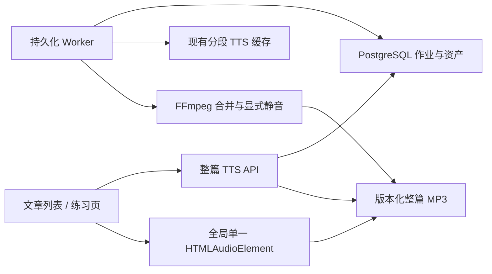
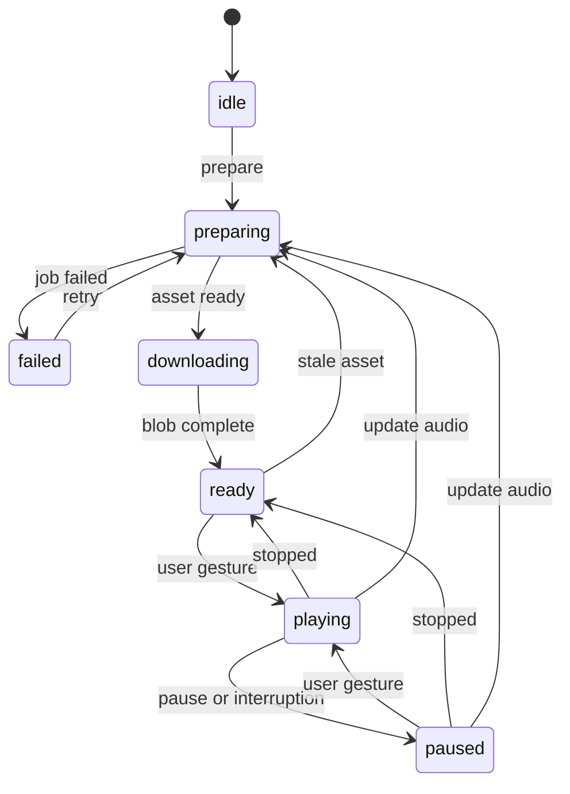

# 技术架构

## 1. 架构决策

采用“分段缓存 + 服务端合并 + 单媒体播放”，不把整篇文本直接作为一个不可观察的 TTS 请求，也不依赖浏览器在后台逐段切换多个 Blob。



选择该方案的原因：

- 复用当前按 `segment_id + voice + speed + text_hash` 缓存的成功资产。
- 保留日语读音覆盖的逐段构造逻辑。
- 单段失败可定位、可重试，不丢弃其他成功结果。
- FFmpeg 显式插入停顿，避免依赖供应商解释换行。
- iOS 后台只播放一个媒体文件，不需要后台 JavaScript 在段落边界创建新请求或切换资源。
- 合并时可生成全局时间轴和真实时长，支持精确恢复。

## 2. 后端组件

### 2.1 整篇准备 API

- 验证文章归属和当前输入快照。
- 解析默认音色、固定速度、停顿与编码策略。
- 计算输入哈希并命中可复用整篇资产。
- 无命中时幂等创建/返回持久化任务。
- 返回可轮询的状态、段进度、失败段和最终资产元数据。

### 2.2 持久化 Worker

- 使用 PostgreSQL 领取任务，不引入 Redis。
- 通过 `lease_owner`、`lease_expires_at`、`heartbeat_at` 防止重复长期占用。
- Worker 崩溃后，过期租约可被其他实例重新领取。
- 每个分段独立重试，使用有上限的指数退避；初始实现最多 3 次。
- 任一分段最终失败：任务 `failed`，不进入合并和发布。

### 2.3 分段准备

- 按 `segment_order` 快照所有段落。
- 复用现有逐段 `tts_input_text` 构造，包括日语读音覆盖。
- 使用默认音色、1.0 倍速、输入文本哈希查找现有 `tts_assets`。
- 缺失时由 Worker 生成，成功后再进入下一阶段。
- `edge-tts` 升级到 7.2.8，并回归跨内部 chunk 的句子时间轴。

### 2.4 FFmpeg 合并

初始编码策略：24 kHz、mono、48 kbps MP3。通过 concat filter 解码并统一重编码；不进行 MP3 字节拼接。

流程：

1. 在受控临时目录准备输入清单。
2. 每两个段落之间插入 750 ms 静音。
3. 文件尾部插入 1500 ms 静音，作为循环边界。
4. 输出临时 MP3。
5. 使用 `ffprobe` 获取最终真实 `duration_ms` 和媒体参数。
6. 构建全局时间轴。
7. 关闭临时输出后使用 `os.replace` 原子发布到正式路径。
8. 资产映射和元数据在一个数据库事务中标为 `ready`；Worker 随后以持有租约为条件把任务标为 `done`。数据库发布失败时删除刚发布的文件。

只有完成第 7 步的文件才允许对外返回。

## 3. 版本与缓存

### 3.1 输入快照

任务创建时冻结：

- `article_id` 和文章所有者。
- 有序段落 ID、顺序和用于 TTS 的文本哈希。
- 解析后的默认音色与 `speed=1.0`。
- 停顿策略、编码配置和时间轴版本。

### 3.2 整篇缓存键

规范化序列化后计算 SHA-256：

```text
article_id
+ ordered[(segment_id, segment_order, segment_tts_text_hash)]
+ resolved_voice
+ speed=1.0
+ pause_policy_version
+ encoder_profile_version
+ timeline_version
```

哈希必须基于明确编码和稳定字段顺序，不使用进程相关的对象字符串表示。

### 3.3 失效语义

- 正文、语言或分段顺序变化会产生新输入哈希。
- 日语读音覆盖变化会改变分段 TTS 文本哈希。
- 音色规则、停顿、编码或时间轴算法变化通过版本字段失效。
- 旧资产不原地覆盖；可以支持正在播放的会话完成。
- 下一次播放通过“当前输入哈希”判断旧资产过期。
- “更新音频”在客户端立即停止旧资产，并请求当前哈希的任务。

## 4. 全局时间轴

每个整篇资产保存：

- 段落的 `global_start_ms` / `global_end_ms`。
- 每句的 `segment_id`、`segment_order`、`sentence_index`、`text`、`start_ms`、`end_ms`。
- 句子时间取现有分段时间轴，加上该段全局起点偏移。
- 静音区间不映射到句子；恢复到静音区仍直接按精确媒体秒数 seek。
- 生成后校验时间单调、范围不越过最终 `duration_ms`。

## 5. 前端播放器

### 5.1 生命周期

- 在应用顶层 Provider 中只创建一个 `HTMLAudioElement`。
- 页面组件只发命令和订阅状态，不拥有音频对象。
- 路由切换不得销毁播放器。
- 切换文章、更新音频、退出登录或释放资源时，撤销 Blob URL。
- 媒体通过带 Bearer 的请求完整下载为 Blob；首版不做永久离线缓存。

### 5.2 状态机



自动播放始终禁止：任务完成、下载完成、页面恢复、中断结束都只能进入 `ready`/`paused`，必须由用户手势进入 `playing`。

### 5.3 循环与睡眠

- 媒体尾部已包含轮次静音，播放器在 `ended` 时 seek 0 并继续。
- “本轮结束”只设置 stop-after-current 标志。
- 15/30/60 分钟记录绝对 `deadline_at`，UI 定时刷新只是展示；每次媒体事件、页面恢复和可见性变化都重新比较墙上时间。
- 到期后 pause、seek/位置按产品规则保留，并清除循环继续动作。

### 5.4 恢复

- 节流保存到 `localStorage`，同时在 `pause`、`pagehide`、`visibilitychange` 时立即保存。
- key 包含当前用户作用域，值包含 `article_id + asset_id + position_ms + updated_at`。
- 24 小时内且资产仍有效时显示恢复入口。
- 不在加载时调用 `play()`。

### 5.5 多标签页与音频冲突

- 优先用 `BroadcastChannel`，并用 `storage` 事件作为兼容回退。
- 播放前广播带随机 tab ID 和递增时间戳的 claim。
- 收到其他 tab 的较新 claim 后立即暂停；接管只影响本地播放器，不影响后端任务。
- 录音、单段与单句音频通过统一 audio focus 协调器暂停整篇播放器。

### 5.6 Media Session

- 若浏览器支持，设置标题、文章名和 artwork（有可用资源时）。
- 注册 play/pause action；不承诺 iOS 对所有 action 的支持。
- 不注册上一段/下一段，因为首版只播放单一整篇资产。

## 6. 安全与资源访问

- 整篇媒体路由以不透明 `asset_id` 定位记录，先验证当前用户拥有对应文章，再发送文件。
- 不接受任意文件名拼接，不暴露磁盘真实路径。
- 对 Range 请求保持兼容，以支持 Safari seek；鉴权必须在解析 Range 前完成。
- 文件路径解析后必须位于配置的整篇媒体根目录。
- 注销时前端立即暂停并撤销 Blob；后端令牌过期不会影响已经完整下载到内存的本次播放。

## 7. 清理与容量

- Worker 启动时及其后每小时执行清理；默认临时/孤儿 TTL 为 24 小时，旧整篇资产保留至少 7 天。
- 只有已有更新 `ready` 版本或文章已软删除的旧整篇资产才能进入清理；每个有效文章的最新 `ready` 资产始终保留。
- 数据库资产先变为 `deleting`，文件删除成功或已不存在后再清空媒体元数据；删除失败保持 `deleting` 供下一轮重试。
- 未被任何资产行引用的 `articles/*.mp3`、遗留合并目录和 `.tmp` 文件超过 TTL 后才删除。
- 不删除仍可能被当前活动任务引用的分段资产。
- 整篇媒体默认硬配额为 10 GiB；合并前按现有整篇文件与预计输出检查，超限以 `storage_limit` 结束任务。
- 记录文件大小用于容量统计和客户端下载确认。
- 初始保留期和磁盘上限通过配置提供，部署文档必须给出默认值与告警建议。

## 8. 已知风险

- iOS 可能在系统压力下暂停或回收 Web 页面，单文件只能降低风险，不能消除平台限制。
- 20,000 个多字节字符会形成较大且耗时的 TTS 任务，需要持久化进度和超时恢复。
- 当前项目无迁移框架，新增表需要兼容现有 `create_all`/schema bootstrap，同时记录后续正式迁移债务。
- 当前媒体存储位于单机挂载，横向扩容前必须迁移到共享存储或对象存储。
